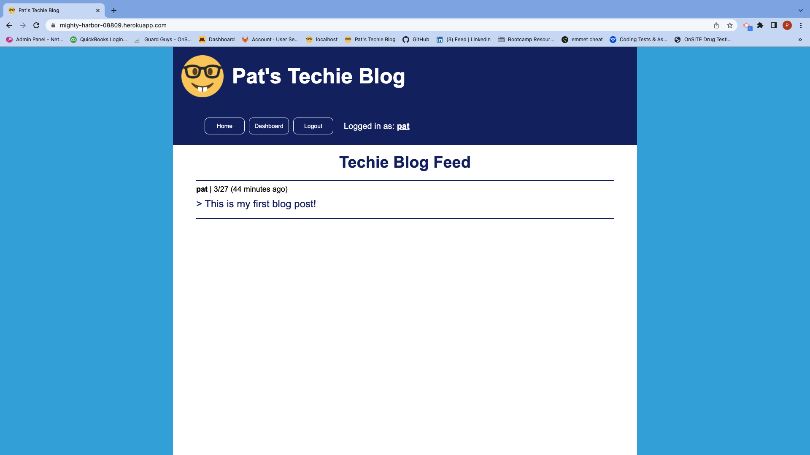

 [](https://opensource.org/licenses/MIT)
 # Pat's Techie Blog
 ## *Table of Contents*
1. [Description](#description)
2. [Usage Information](#usage-information)
3. [Tests](#tests)
4. [Questions](#questions)
5. [License Info](#license-info)

 _ _ _
 ## *Description*
 ### This is my submission for the week #14 Model-View-Controller (MVC) Challenge: Tech Blog. Our challenge was to build a CMS-style blog site similar to a Wordpress iste, where developers can pbulish their blog posts and comment on other developers' posts as well.  The site was to be built completely from scratch and deployed to Heroku.  It follows the MVC paradigm in its architectural structure, uses Handlebars.js as the templating language, Sequelize as the ORM, and express-session npm package for authentication.

 ### The app allows all visitors to the site to read blog posts and their respective comments.  Authorized users who are logged into the app are allowed to leave comments on any blog post as well as edit their own posts.

 - URL https://mighty-harbor-08809.herokuapp.com/
 - GitHub Repsitory https://github.com/pjlawler/pats-techie-blog

 
 _ _ _
 ## *Usage Information*
  - Run npm install as well as add in an .env file for the DB login as well as the session secret password. 
  - The included env.exaple file shows the required information that needs to be included in the .env file.
```
  DB_NAME=tech_blog_db
  DB_USER= <!-- must be your personal username for mysql2 -->
  DB_PW= <!-- must be your personal password for mysql2 -->
  SESSION_SECRET=  <!-- can be any phrase you wish to use -->
```
  - Run source db/schema.sql from the mysql2 shell to create the database 'tech_blog_db'


  - - -
 
 ## *Tests*
  Jest package is included for testing of the helpers.js functions.
  - - -
 
 ## *Questions*
 ###   For questions or comments concerning this project please contact, Patrick Lawler, the author, owner and manager the work via either github or email. Links for each are listed below.
 - github: [pjlawler](https://github.com/pjlawler)
 - email: patlaw777@icloud.com
 _ _ _
 ## *License Info*
  [](https://opensource.org/licenses/MIT)  Copyright Ⓒ 2022 Patrick Lawler
      
    Permission is hereby granted, free of charge, to any person obtaining a copy of this software and associated documentation files (the "Software"), to deal in the Software without restriction, including without limitation the rights to use, copy, modify, merge, publish, distribute, sublicense, and/or sell copies of the Software, and to permit persons to whom the Software is furnished to do so, subject to the following conditions:
    
    The above copyright notice and this permission notice shall be included in all copies or substantial portions of the Software.
    
    THE SOFTWARE IS PROVIDED "AS IS", WITHOUT WARRANTY OF ANY KIND, EXPRESS OR IMPLIED, INCLUDING BUT NOT LIMITED TO THE WARRANTIES OF MERCHANTABILITY, FITNESS FOR A PARTICULAR PURPOSE AND NONINFRINGEMENT. IN NO EVENT SHALL THE AUTHORS OR COPYRIGHT HOLDERS BE LIABLE FOR ANY CLAIM, DAMAGES OR OTHER LIABILITY, WHETHER IN AN ACTION OF CONTRACT, TORT OR OTHERWISE, ARISING FROM, OUT OF OR IN CONNECTION WITH THE SOFTWARE OR THE USE OR OTHER DEALINGS IN THE SOFTWARE.